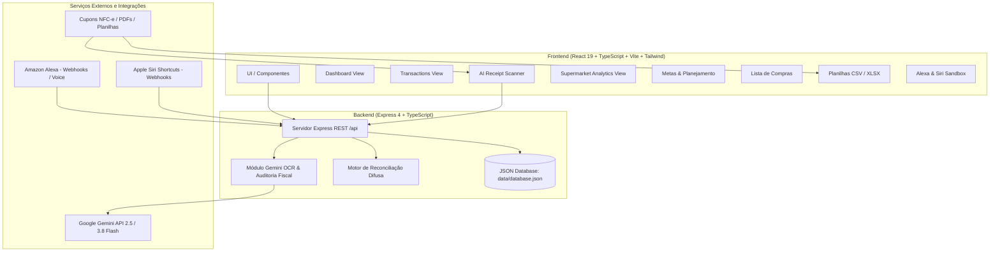

# 💑 Finanças Casal Duarte (2026)

<div align="center">


**Sistema integrado de gestão financeira familiar com inteligência artificial, auditoria fiscal OCR, controle de metas, lista de compras inteligente, assistentes de voz (Alexa e Siri) e analytics avançado de consumo.**

[](https://react.dev/)
[](https://www.typescriptlang.org/)
[](https://tailwindcss.com/)
[](https://ai.google.dev/)
[](https://expressjs.com/)
[](https://vitejs.dev/)

---

*Aplicativo concebido e prototipado no **Google AI Studio** para o Casal Duarte (Felipe & Camila).*  
*App no Google AI Studio: [Ver no AI Studio](https://ai.studio/apps/786ee1c0-d468-4f23-a80b-614fbce9262b)*

</div>

---

## 📌 Sumário

1. [Visão Geral e Propósito](#-visão-geral-e-propósito)
2. [Arquitetura e Fluxo do Sistema](#-arquitetura-e-fluxo-do-sistema)
3. [Tecnologias Utilizadas](#-tecnologias-utilizadas)
4. [Estrutura Orçamentária do Casal](#-estrutura-orçamentária-do-casal)
5. [Módulos e Funcionalidades Detalhadas](#-módulos-e-funcionalidades-detalhadas)
   - [Dashboard Executivo & Indicadores](#1-dashboard-executivo--indicadores)
   - [Gestão de Transações & Split de Itens](#2-gestão-de-transações--split-de-itens)
   - [IA Fiscal: Scanner de Comprovantes (Gemini Vision)](#3-ia-fiscal-scanner-de-comprovantes-gemini-vision)
   - [Metas Financeiras & Poupança](#4-metas-financeiras--poupança)
   - [Lista de Compras & Reconciliação Automática](#5-lista-de-compras--reconciliação-automática)
   - [Supermarket & Consumer Analytics (Carnes, Mercearia e Inflação MoM)](#6-supermarket--consumer-analytics-carnes-mercearia-e-inflação-mom)
   - [Importador de Planilhas (Excel e CSV)](#7-importador-de-planilhas-excel-e-csv)
   - [Integrações de Voz: Alexa e Atalhos da Siri](#8-integrações-de-voz-alexa-e-atalhos-da-siri)
6. [Catálogo de Endpoints da API REST](#-catálogo-de-endpoints-da-api-rest)
7. [Como Configurar e Executar Localmente](#-como-configurar-e-executar-localmente)
8. [Estrutura de Pastas do Projeto](#-estrutura-de-pastas-do-projeto)
9. [Variáveis de Ambiente](#-variáveis-de-ambiente)

---

## 📖 Visão Geral e Propósito

O **Finanças Casal Duarte** foi projetado para suprir a necessidade de uma gestão financeira ágil, visual e colaborativa para um casal moderno. O projeto nasceu da necessidade de unificar e modernizar as planilhas financeiras mensais de 2026 (Janeiro a Agosto), agregando automações baseadas em inteligência artificial e controle total do consumo doméstico.

### Principais Objetivos:
- **Acabar com o preenchimento manual maçante:** Ler cupons fiscais e recibos via fotos ou PDFs usando visão computacional do Gemini, extraindo itens individuais automaticamente.
- **Auditoria de gastos no supermercado:** Saber exatamente quanto é gasto em carne bovina, aves, suínos, produtos de limpeza, higiene e hortifrúti, além de monitorar a inflação de cada produto mês a mês.
- **Reconciliação compras x lista:** Cruzar o que foi comprado na nota fiscal com a lista de pendências da casa, identificando compras por impulso ou itens esquecidos.
- **Comandos de voz práticos:** Permitir adicionar itens à lista de compras ou registrar uma despesa imediata na rua falando com a **Alexa** ou via **Atalhos da Siri (iPhone)**.
- **Previsibilidade orçamentária:** Acompanhar em tempo real a comparação entre **Expectativa** (Planejado) e **Realidade** (Realizado), além de monitorar a taxa de poupança conjunta.

---

## 🏗 Arquitetura e Fluxo do Sistema

O projeto é estruturado em uma arquitetura monorégia moderna com backend Node.js/Express e frontend React 19/Vite:



---

## 💻 Tecnologias Utilizadas

### Frontend
- **React 19 (`19.0.1`)**: Biblioteca para interfaces declarativas e performáticas com hooks customizados.
- **TypeScript (`5.8.2`)**: Tipagem estática em 100% dos componentes e contratos de dados.
- **Vite (`6.2.3`)**: Bundler e servidor HMR ultrarrápido integrado como middleware.
- **Tailwind CSS v4 (`4.1.14`)**: Framework utilitário de estilização moderna com suporte completo a design tokens.
- **Lucide React (`0.546.0`)**: Conjunto de ícones consistentes e elegantes.
- **Recharts (`3.10.1`)**: Renderização de gráficos dinâmicos (Barras, Linhas, Áreas, Pizza).
- **Motion (`12.23.24`)**: Micro-interações e transições fluidas.
- **PapaParse (`5.7.0`)**: Parser de alta velocidade para arquivos CSV.
- **SheetJS / XLSX (`0.18.5`)**: Leitura e decodificação client-side de planilhas Excel (`.xlsx`, `.xls`).

### Backend
- **Node.js & Express (`4.21.2`)**: Servidor HTTP RESTful estruturado com suporte a payloads base64 de até 25MB.
- **TSX (`4.21.0`)**: Execução de scripts TypeScript em Node.js em tempo de desenvolvimento.
- **Google Gen AI SDK (`@google/genai 2.4.0`)**: SDK oficial da Google para integração com a família de modelos Gemini 2.5 e 3.8.
- **Multer (`2.3.0`)**: Processamento de uploads multipart/form-data.
- **Banco de Dados JSON Nativo**: Camada de persistência resiliente em arquivo `data/database.json` com seed inicial completo de 2026.

---

## 💰 Estrutura Orçamentária do Casal

O orçamento do Casal Duarte é segmentado em **3 macrocategorias**, cada uma contendo subcategorias padronizadas:

| Categoria | Descrição | Subcategorias |
|---|---|---|
| 🔒 **Invariável** | Custos fixos e essenciais que ocorrem todos os meses com previsibilidade | • Aluguel<br>• Condomínio<br>• Internet<br>• Rastreador<br>• Seguro<br>• Assinaturas Extras |
| 🛒 **Variável** | Despesas cotidianas e essenciais sujeitas a flutuação e controle estrito | • Supermercado<br>• Combustível<br>• Farmácia<br>• Lazer & Restaurantes<br>• Pedágio<br>• Estacionamento |
| ⚠️ **Extra / Eventualidades** | Despesas sazonais, emergenciais, cuidados com o veículo e compras patrimoniais | • Manutenção de carro<br>• IPVA<br>• Eletrodomésticos<br>• Móveis<br>• Saúde<br>• Eventualidades |

### Perfis de Usuário
- **Felipe Duarte** (`usr-felipe` | `felipemd114@gmail.com`): Administrador / Casal.
- **Camila Duarte** (`usr-camila` | `camila@duarte.com`): Administradora / Casal.

---

## 🚀 Módulos e Funcionalidades Detalhadas

### 1. Dashboard Executivo & Indicadores
- **Cards de KPIs**: Receitas totais do casal, despesas totais, saldo líquido, economia realizada e comparação entre total planejado e realizado.
- **Alerta de Estouro de Orçamento**: Destaque em tempo real para qualquer subcategoria que tenha ultrapassado o teto orçamentário configurado.
- **Custo Integrado do Carro**: Visão unificada que soma automaticamente combustível, seguro, rastreador, IPVA, manutenção mecânica, pedágios e estacionamento.
- **Distribuição de Despesas**: Gráficos de barras horizontais e de pizza categorizados.
- **Filtros Temporais**: Navegação mensal (Jan a Ago/2026) e consolidação anual do ano de 2026.

### 2. Gestão de Transações & Split de Itens
- **Tabela Completa de Movimentações**: Visualização de receitas e despesas com status (`pago` ou `previsto`) e formas de pagamento (`Pix`, `Cartão`, `Débito`, `Dinheiro`).
- **Split de Compras (Itens)**: Suporte a transações compostas, permitindo detalhar cada produto comprado na mesma nota fiscal com quantidade, preço unitário e categoria.
- **Edição Rápida Inline**: Alteração de categorias e dados diretamente na visualização.
- **Exportação CSV**: Download direto de arquivo `.csv` formatado para Excel com codificação UTF-8 com BOM.

### 3. IA Fiscal: Scanner de Comprovantes (Gemini Vision)
- **OCR e Auditoria Fiscal Especializada**:
  - Prompt com instruções de auditoria fiscal para documentos fiscais brasileiros (NFC-e, SAT CF-e, DANFE Simplificada e cupons térmicos de supermercados).
  - Reconhecimento de razão social, nome fantasia, CNPJ, data de emissão no padrão brasileiro e valor total.
  - **Extração completa de todos os itens do cupom**, convertendo abreviações térmicas (ex: `"ARR BRANC 5KG"` ➔ `"Arroz Branco 5kg"`).
  - Classificação automática de cada item em: `alimento`, `bebida`, `limpeza`, `higiene`, `hortifruti`, `acougue`, `remedio`, `combustivel`, `pet`, `lazer`, `utilidade` ou `outro`.
- **Resiliência Multi-modelo com Fallback**:
  - Tenta em cascata os modelos: `gemini-2.5-flash` ➔ `gemini-3.8-flash` ➔ `gemini-3.1-flash-lite`.
  - Tratamento de sobrecarga transitória (`503`, `429`) com retentativas automáticas e backoff exponencial.
  - Parser heurístico local integrado para processar textos e chaves coladas manualmente mesmo se a API estiver indisponível.
- **Revisão Humana**: Formulário editável pré-preenchido pela IA antes do salvamento definitivo no banco de dados.

### 4. Metas Financeiras & Poupança
- **Meta de Poupança Conjunta**: Acompanhamento da reserva mensal guardada pelo casal.
- **Tetos de Gastos por Categoria**: Barras de progresso com porcentagem atingida, saldo restante e sinalizadores de perigo.
- **Meta Anual do Veículo**: Acompanhamento do teto de R$ 14.000,00 anuais para manutenção e custos automotivos.

### 5. Lista de Compras & Reconciliação Automática
- Itens organizados por tipo de loja (Supermercado, Farmácia, Posto, Oficina, Outros).
- Registro de origem do item: Adicionado manualmente, via **Alexa** ou via **Siri**.
- **Reconciliação Inteligente com a Nota Fiscal**:
  - Ao escanear o comprovante no módulo de IA, o sistema realiza correspondência difusa (*fuzzy token matching*) entre os produtos lidos e a lista de compras pendente.
  - Marca automaticamente como comprados os itens que estavam na lista.
  - Gera relatório categorizado: **Itens comprados da lista**, **Compras extras / impulso** e **Itens pendentes que faltaram**.

### 6. Supermarket & Consumer Analytics (Carnes, Mercearia e Inflação MoM)
- **Visão Geral do Supermercado**: Ticket médio por compra, quantidade de produtos distintos, frequência de idas ao mercado e maior despesa individual.
- **Auditoria de Açougue & Carnes**:
  - Consumo total em quilogramas (kg) e valor em reais (R$).
  - Preço médio por kg e participação do açougue no total do supermercado.
  - Distribuição por tipo de proteína animal: Carne Bovina, Aves/Frango e Suínos/Embutidos.
  - Ranking detalhado dos cortes mais consumidos: Patinho Moído, Filé de Peito de Frango, Picanha Nobre, Alcatra Especial, Contrafilé Prime, Sobrecoxa Desossada, Linguiça de Pernil e Costelinha Suína.
  - Evolução mês a mês do consumo de carne (Jan a Ago/2026).
- **Catálogo Integral de Itens Consumidos**:
  - Tabela com todos os produtos adquiridos pela família.
  - Pesquisa em tempo real, filtros por categoria e ordenações variadas.
  - **Cálculo da Inflação MoM (Month-over-Month)**: Exibe a variação percentual do preço médio do item ao longo do ano.
- **Modal de Detalhes do Produto**:
  - Gráfico de histórico mensal de preço e quantidade adquirida.
  - Estabelecimentos onde o item foi comprado.

### 7. Importador de Planilhas (Excel e CSV)
- **Upload Drag-and-Drop**: Suporta arquivos `.xlsx`, `.xls` e `.csv`.
- **Mapeamento Automático e Tolerante**:
  - Detecta automaticamente as colunas da planilha do casal: `CATEGORIA`, `DESCRICAO`, `SITUACAO`, `EXPECTATIVA`, `REALIDADE`, `DIFERENCA` e `OBSERVACOES`.
  - Converte nomes de meses por extenso em formato ISO (`janeiro` ➔ `2026-01`).
  - Cria transações para os valores realizados e alimenta a base de expectativas mensais.
- **Restauração de Dados**: Botão para resetar a base para os dados padrão do Casal Duarte (Jan-Ago 2026).

### 8. Integrações de Voz: Alexa e Atalhos da Siri
A aplicação inclui endpoints específicos para assistentes virtuais com respostas formatadas para sintetização de voz (`speech`):

- **Amazon Alexa**:
  - Adicionar mantimentos à lista por voz: *"Alexa, adicionar 2 kg de arroz à lista de supermercado"*.
  - Consultar despesas por categoria: *"Alexa, quanto eu gastei em supermercado este mês?"*.
  - Alerta de estouros orçamentários: *"Alexa, alguma categoria estourou o orçamento este mês?"*.
- **Apple Siri (Atalhos do iOS)**:
  - Registrar despesa rápida na rua: *"Siri, registrar despesa de R$ 50 em Lazer hoje"*.
  - Consultar metas ativas: *"Siri, consultar metas do mês"*.
- **Sandbox Interativo no App**: Painel na interface para testar e simular os webhooks e comandos de voz diretamente no navegador.

---

## 📡 Catálogo de Endpoints da API REST

| Método | Endpoint | Descrição |
|---|---|---|
| `GET` | `/api/health` | Healthcheck do servidor |
| `GET` | `/api/users` | Lista usuários (Felipe & Camila) |
| `POST` | `/api/auth/login` | Login simplificado |
| `GET` | `/api/categories` | Lista macrocategorias |
| `GET` | `/api/subcategories` | Lista subcategorias e tetos padrão |
| `POST` | `/api/subcategories` | Cria nova subcategoria |
| `GET` | `/api/establishments` | Lista estabelecimentos comerciais |
| `POST` | `/api/establishments` | Cria ou recupera estabelecimento |
| `GET` | `/api/transactions` | Consulta transações com filtros (`mes_ano`, `categoria`, etc.) |
| `POST` | `/api/transactions` | Cria nova receita ou despesa (com split de itens opcional) |
| `PUT` | `/api/transactions/:id` | Atualiza transação existente |
| `DELETE`| `/api/transactions/:id` | Remove transação |
| `GET` | `/api/goals` | Lista metas e calcula consumo em tempo real |
| `POST` | `/api/goals` | Cria nova meta de economia ou gasto |
| `PUT` | `/api/goals/:id` | Atualiza meta |
| `DELETE`| `/api/goals/:id` | Remove meta |
| `GET` | `/api/shopping-list` | Lista itens da lista de compras |
| `POST` | `/api/shopping-list` | Adiciona item à lista |
| `PATCH`| `/api/shopping-list/:id/toggle` | Alterna status comprado/pendente |
| `DELETE`| `/api/shopping-list/:id` | Remove item da lista |
| `POST` | `/api/receipts/analyze` | Processa comprovante via Gemini OCR / Leitor Local |
| `POST` | `/api/receipts/reconcile` | Reconcilia itens do comprovante com a lista de compras |
| `POST` | `/api/import/spreadsheet` | Importa linhas de planilha Excel ou CSV |
| `POST` | `/api/database/reset` | Restaura base modelo Jan-Ago 2026 |
| `GET` | `/api/reports/dashboard` | Métricas executivas, expectativas vs realidade e evolução |
| `GET` | `/api/reports/supermarket-analytics` | Análise minuciosa de supermercado, açougue e catálogo |
| `GET` | `/api/export/csv` | Download do arquivo CSV completo das finanças |
| `POST` | `/api/listas-compras` | Webhook Alexa: Adiciona item à lista por voz |
| `GET` | `/api/resumo-mensal` | Webhook Alexa: Resumo falado de gastos mensais |
| `GET` | `/api/categorias-estouradas`| Webhook Alexa: Notificação falada de categorias acima do limite |
| `POST` | `/api/siri/transacao` | Webhook Siri: Registro rápido de despesa via atalho iOS |
| `GET` | `/api/siri/metas` | Webhook Siri: Consulta de progresso de metas |

---

## 🛠 Como Configurar e Executar Localmente

### Pré-requisitos
- **Node.js**: Versão 18 ou superior instalada.
- **npm** ou **bun**.
- **Chave de API do Google Gemini**: Obtenha gratuitamente em [Google AI Studio](https://aistudio.google.com/).

### Passo a Passo

1. **Clone ou navegue até o diretório do projeto:**
   ```bash
   cd d:\finanças-casal-duarte
   ```

2. **Instale as dependências:**
   ```bash
   npm install
   ```

3. **Configure as variáveis de ambiente:**
   Crie um arquivo `.env` ou `.env.local` na raiz do projeto com o seguinte conteúdo:
   ```env
   GEMINI_API_KEY="SUA_CHAVE_DO_GOOGLE_AI_STUDIO_AQUI"
   PORT=3000
   NODE_ENV=development
   ```

4. **Inicie a aplicação em modo desenvolvimento:**
   ```bash
   npm run dev
   ```

5. **Acesse no navegador:**
   Abra [http://localhost:3000](http://localhost:3000) no seu navegador.

---

## 📂 Estrutura de Pastas do Projeto

```
finanças-casal-duarte/
├── data/
│   └── database.json              # Banco de dados local em formato JSON
├── server/
│   ├── db.ts                      # Repositório de dados, schemas e ingestão de planilhas
│   └── gemini.ts                  # Auditoria fiscal, prompts e comunicação com Google Gemini
├── src/
│   ├── components/
│   │   ├── AiReceiptScanner.tsx       # Scanner de cupons fiscais com IA e reconciliação
│   │   ├── DashboardView.tsx          # Painel principal de indicadores e gráficos
│   │   ├── GoalsView.tsx              # Metas de gastos e poupança conjunta
│   │   ├── Header.tsx                 # Barra superior com troca de membro e seletor de mês
│   │   ├── MobileNavigation.tsx       # Barra de navegação inferior mobile e drawer
│   │   ├── ReportsView.tsx            # Relatórios consolidados por membro, loja e subcategoria
│   │   ├── ShoppingListView.tsx       # Lista de compras e conferência de mercado
│   │   ├── SpreadsheetImporter.tsx    # Upload e leitura de planilhas Excel / CSV
│   │   ├── SupermarketAnalyticsView.tsx # Analytics de itens, açougue e inflação MoM
│   │   ├── TransactionsView.tsx       # Tabela de transações com filtros e split de itens
│   │   └── VoiceIntegrationsView.tsx  # Documentação e testes de comandos Alexa e Siri
│   ├── utils/
│   │   └── formatters.ts          # Formatadores de moeda (BRL), datas (pt-BR) e meses
│   ├── App.tsx                    # Componente raiz e gerenciamento de estado global
│   ├── index.css                  # Estilos globais e importações do Tailwind CSS
│   ├── main.tsx                   # Ponto de entrada do React
│   └── types.ts                   # Definições completas de interfaces e tipos TypeScript
├── .env.example                   # Exemplo de configuração de variáveis de ambiente
├── metadata.json                  # Metadados do Google AI Studio
├── package.json                   # Dependências e scripts do projeto
├── server.ts                      # Servidor Express com rotas REST e middleware Vite
├── tsconfig.json                  # Configurações do compilador TypeScript
└── vite.config.ts                 # Configuração do Vite com plugins React e Tailwind
```

---

## 🔐 Variáveis de Ambiente

| Variável | Obrigatória? | Descrição |
|---|---|---|
| `GEMINI_API_KEY` | **Sim** (para IA) | Chave de API do Google Gemini gerada no Google AI Studio. |
| `APP_URL` | Opcional | URL pública onde o app está hospedado (injetada no Cloud Run). |
| `PORT` | Opcional | Porta HTTP do servidor (Padrão: `3000`). |
| `NODE_ENV` | Opcional | Modo de execução (`development` ou `production`). |

---

<div align="center">

Desenvolvido para o **Casal Duarte** &bull; 2026

</div>
